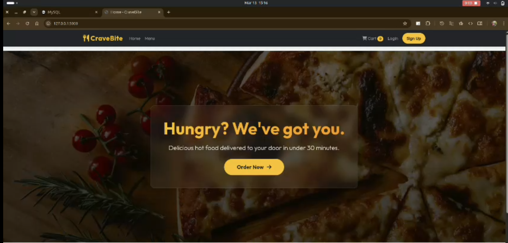
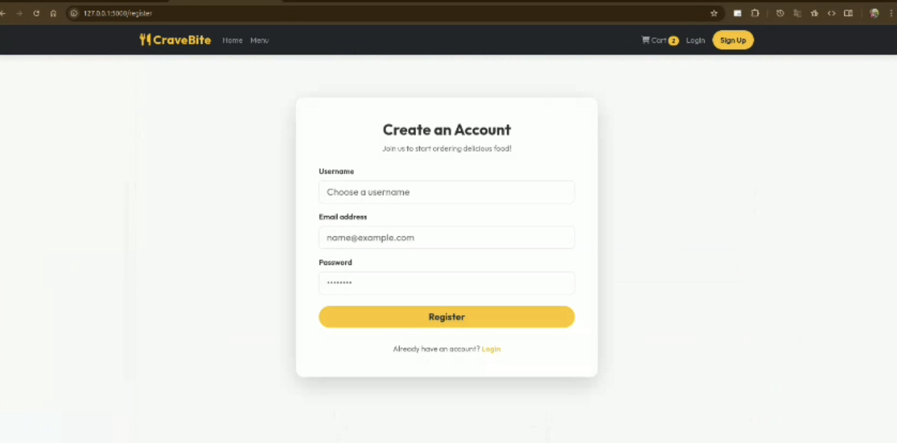
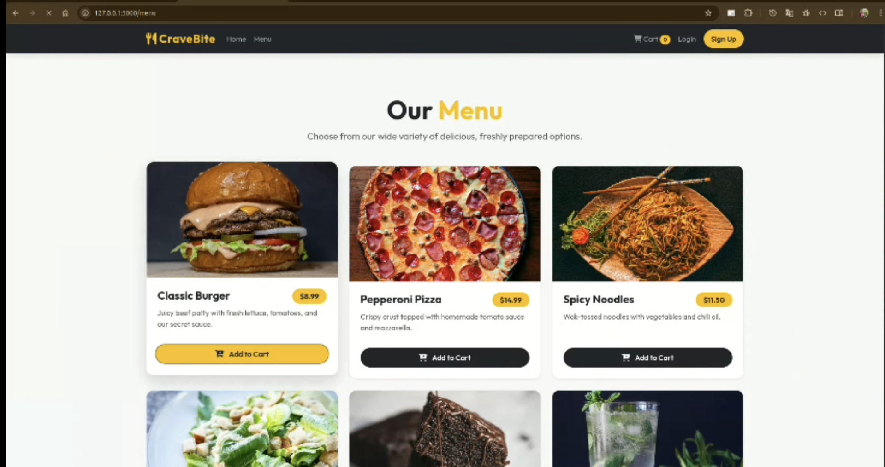
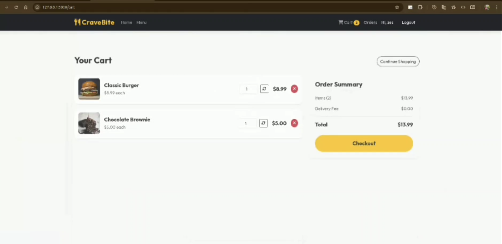
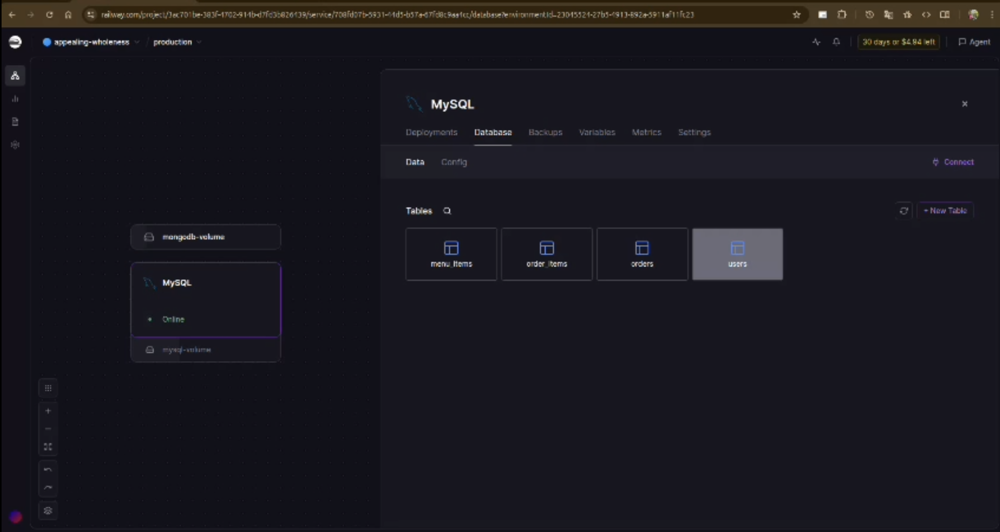
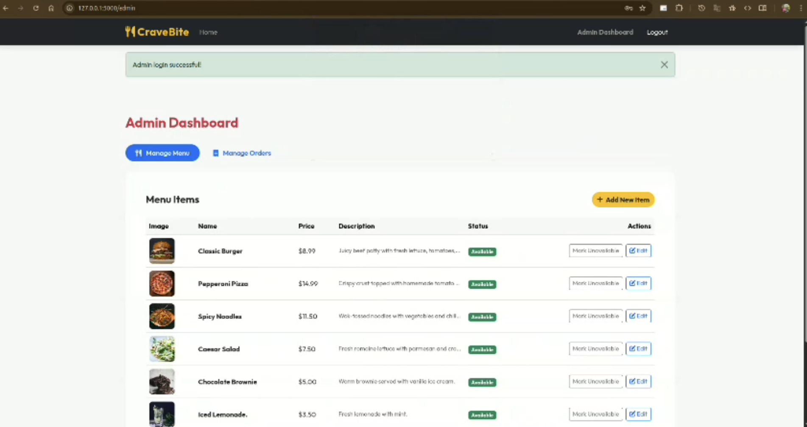

# 🍔 Food Delivery Website Simulator



## 📖 Overview
This **Food Delivery Website Simulator** is an academic project designed to demonstrate the full-stack architecture of a modern e-commerce web application. 

It provides an interactive, beautifully designed web-based interface where users can browse an organized menu, securely manage a shopping cart, and place simulated orders. It also features a secure administrative dashboard for managing the restaurant's catalog and order fulfillment pipeline.

*Note: This project is strictly for academic demonstration. It operates on simulated data structures in Python memory by default to allow for rapid UI testing without a live database, though the architecture is prepared for a seamless MySQL database integration.*

---

## ✨ Core Features

### 🛒 1. Customer Interface
*   **Modern UI/UX**: Built using Vanilla CSS with Bootstrap 5 integration, featuring responsive design, glassmorphism elements, CSS animations, and a high-contrast layout.
*   **Interactive Menu**: A dynamic catalog displaying food items with rich images, descriptions, and pricing.
*   **Dynamic Shopping Cart**: Utilizes Flask server-side `session` objects to securely store user cart data across requests. Features instant total calculations, quantity adjustments, and item removal.
*   **Order Fulfillment Simulation**: Users can view simulated past orders and real-time dashboard updates reflecting the status of their current orders.

### ⚙️ 2. Admin Dashboard
*   **Catalog Management**: Provides a secure interface for administrators to add, edit, or remove items from the global menu dynamically.
*   **Order Tracking**: Allows administrators to view a live feed of incoming customer orders.
*   **State Machine Simulation**: Admins can change order statuses (e.g., 'Order Placed' -> 'Preparing' -> 'Out for Delivery' -> 'Delivered'), simulating a real kitchen pipeline.

---

## 📸 Screenshots

Here are some previews of the application interface:

| landing page | sign in page |
| :---: | :---: |
|  |  |

| Menu section | Orders section |
| :---: | :---: |
|  |  |

| SQL database |Admin dashboard |
| :---: | :---: |
|  |  |

---

## 🛠️ Technology Stack

### Frontend Architecture
*   **HTML5 / Jinja2 Templates**: Used for constructing modular, reusable structural components.
*   **Bootstrap 5**: Utilized for rapid grid layout creation, responsive navigation, and pre-built interactive UI components.
*   **Custom CSS**: Applied in `style.css` to override Bootstrap defaults and inject premium aesthetics.
*   **JavaScript**: Minimal client-side JS used primarily for Bootstrap component initialization.

### Backend Architecture
*   **Python 3**: The core backend scripting language.
*   **Flask Configuration**: The lightweight WSGI web application framework used to handle routing, request parsing, and template rendering.
*   `.env` Environment Variables: Used to keep database credentials and Flask Secret Keys secure.

### Database Architecture
*   **MySQL Database**: Relational database chosen for robust data integrity regarding Users, Menu Items, Orders, and Order Items.
*   **mysql-connector-python**: The adapter used to facilitate DB connection from Python logic.

---

## 🚀 Installation & Setup Guide

Follow these steps to set up and run the Food Delivery Website on your local machine.

### Prerequisites
*   Python 3.x
*   pip (Python package installer)
*   A MySQL database (Local or remote)

### Step 1: Download or Clone the Project
Open your terminal and navigate to the project folder:
```bash
cd path/to/food_delivery_website
```

### Step 2: Set up a Virtual Environment
Create the virtual environment:
```bash
python3 -m venv venv
```

Activate the virtual environment:
*   **On Linux/macOS:**
    ```bash
    source venv/bin/activate
    ```
*   **On Windows:**
    ```bash
    venv\Scripts\activate
    ```

### Step 3: Install Required Packages
```bash
pip install -r requirements.txt
```

### Step 4: Configure the Database
1.  Open the `.env` file in the root of the project.
2.  Update the file with your actual database credentials:
    ```env
    DB_USER=your_db_username
    DB_PASSWORD=your_db_password
    DB_HOST=your_db_host
    DB_PORT=your_db_port
    DB_NAME=your_db_name
    SECRET_KEY=a_random_secure_string_for_flask_sessions
    ```
3.  Execute the SQL script located in `database/schema.sql` in your MySQL database to create the necessary tables.

### Step 5: Run the Server
With the virtual environment activated, start the Flask development server:
```bash
python run.py
```

### Step 6: View the Website
Open your web browser and go to:
**`http://127.0.0.1:5000`**

---

## 📂 Project Structure Overview
```text
food_delivery_website/
│
├── app/                        # Encapsulated application module
│   ├── __init__.py             # Flask application factory
│   ├── routes.py               # Controller logic and routing mapping
│   ├── models.py               # Database connection logic
│   │
│   ├── static/                 # Served public assets
│   │   ├── css/style.css       # Global stylesheet
│   │
│   └── templates/              # Jinja2 views
│       ├── base.html           # Master layout
│       ├── index.html          # Landing page
│       ├── menu.html           # Catalog view
│       ├── cart.html           # Shopping cart view
│       ├── login.html          # Auth interface (stub)
│       ├── register.html       # Auth interface (stub)
│       ├── admin.html          # Admin dashboard
│       └── history.html        # Order history tracking
│
├── database/                   # Database logic
│   └── schema.sql              # DDL schema for MySQL tables
│
├── config.py                   # Environment configuration class
├── requirements.txt            # Explicit dependency locking
├── .env                        # Secure environment variables configuration
└── run.py                      # Application entry point script
```
